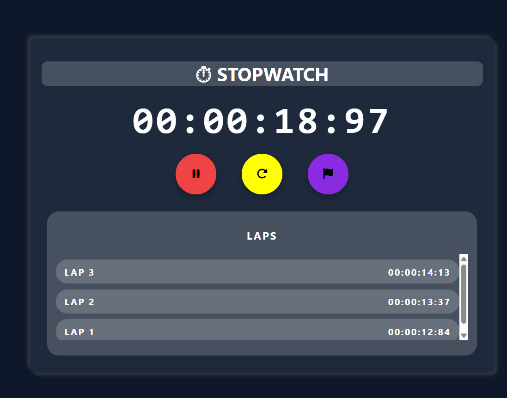

# ⏱ Stopwatch

A modern and responsive stopwatch application built using **HTML, CSS, and JavaScript**. The project features precise time tracking, lap recording, intuitive controls, and a clean dark-themed user interface with smooth animations.

## 🚀 Features

* ▶️ Start and Pause using a single toggle button
* 🔄 Reset stopwatch and clear all recorded laps
* 🏁 Record unlimited lap times
* ⏱ Accurate timing with **centisecond (1/100 sec)** precision
* 📌 Latest lap appears at the top
* 🎨 Modern dark-themed UI with hover animations
* 📱 Responsive and clean layout
* 🔒 Intelligent button states (Lap and Reset are disabled when not applicable)

## 🛠️ Built With

* HTML5
* CSS3
* JavaScript (ES6)
* Font Awesome Icons


 ## 📷 Screenshot




## Demo Video : https://youtu.be/yAcCxt7i4GE


## 📂 Project Structure

```
Stopwatch/
│── index.html
│── style.css
│── script.js
└── README.md
```

## 🎯 What I Learned

While building this project, I practiced:

* DOM Manipulation
* Event Listeners
* JavaScript Timers (`setInterval` & `clearInterval`)
* Working with `Date.now()`
* Dynamic HTML element creation
* State management
* Responsive UI design
* CSS transitions and hover effects

## 💡 Future Improvements

* Highlight fastest and slowest laps
* Keyboard shortcuts (Space, L, R)
* Export lap times
* Save stopwatch state using Local Storage
* Light/Dark theme toggle
* Split time mode

## ▶️ How to Run

1. Clone the repository

```bash
git clone https://github.com/itanuj-thakur/StopWatch.git
```

2. Open the project folder.

3. Run `index.html` in your browser.


Made with ❤️ by **Tanuj Thakur**
